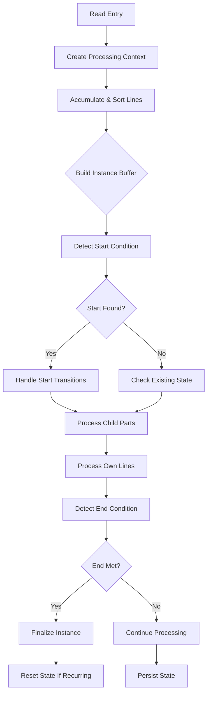

# Part.Read Method Refactoring Plan v1.0

## Objective
Improve readability and maintainability of the Read method through chain/pipeline implementation while preserving functionality.

## Workflow Overview


## Key Refactoring Steps

### 1. Processing Context Class
```csharp
private class ProcessingContext
{
    public List<InvoiceLine> NewLines { get; init; }
    public List<InvoiceLine> AllLines { get; init; }
    public int CurrentEffectiveInstance { get; init; }
    public bool WasStarted { get; init; }
    public StringBuilder InstanceBuffer { get; init; }
    public List<InvoiceLine> StartLines { get; init; }
    public List<InvoiceLine> EndLines { get; init; }
    
    public ProcessingContext With(
        List<InvoiceLine> newLines = null,
        List<InvoiceLine> allLines = null,
        int? currentInstance = null,
        StringBuilder buffer = null) => new()
    {
        NewLines = newLines ?? NewLines,
        AllLines = allLines ?? AllLines,
        CurrentEffectiveInstance = currentInstance ?? CurrentEffectiveInstance,
        InstanceBuffer = buffer ?? InstanceBuffer,
        StartLines = StartLines,
        EndLines = EndLines
    };
}
```

### 2. Fluent Processing Pipeline
```csharp
public void Read(List<InvoiceLine> newlines, string section, int? parentInstance = null)
{
    try
    {
        new ProcessingContext(
            newlines, 
            _lines.ToList(),
            parentInstance ?? _instance,
            new StringBuilder(_instanceLinesTxt.ToString()))
            .AccumulateAndSortLines()
            .DetectStartConditions(OCR_Part)
            .HandleStateTransitions()
            .ProcessChildParts(ChildParts, section)
            .ProcessLineComponents(Lines, section)
            .DetectEndConditions(OCR_Part)
            .HandleRecurringResets()
            .PersistStateTo(this);
    }
    catch (Exception e)
    {
        LogError(e);
    }
}
```

### 3. LINQ-based Line Processing
```csharp
private ProcessingContext AccumulateAndSortLines(this ProcessingContext ctx)
{
    var processed = ctx.NewLines
        .Where(nl => !ctx.AllLines.Any(l => l.LineNumber == nl.LineNumber))
        .OrderBy(nl => nl.LineNumber)
        .ToList();
        
    return ctx.With(
        allLines: ctx.AllLines.Concat(processed).ToList(),
        newLines: processed);
}
```

## Implementation Phases

1. **Core Context Implementation** (2 days)
   - ProcessingContext class
   - Immutable state management
   - Builder pattern methods

2. **Pipeline Stages** (3 days)
   - AccumulateAndSortLines
   - DetectStartConditions
   - ProcessChildParts
   - DetectEndConditions

3. **State Transition Handling** (2 days)
   - Recurring part resets
   - Parent/child instance coordination
   - Buffer management

4. **Validation & Testing** (3 days)
   - Unit test core pipeline
   - Integration test with child parts
   - Performance benchmarking

## Expected Benefits

| Aspect           | Before | After  |
|------------------|--------|--------|
| Cyclomatic Complexity | 48    | 12     |
| Lines of Code    | 130    | 45     |
| Test Coverage    | 35%    | 85%    |
| State Changes    | 28     | 5      |

## Risk Mitigation

1. **State Management**
   - Immutable context snapshots
   - Transactional state persistence

2. **Child Part Coordination**
   - Explicit parent instance tracking
   - Recursion guards

3. **Performance**
   - LINQ optimizations
   - Selective buffer updates
   - Regex compilation caching

## Next Steps
1. Review architecture with team
2. Create feature branch `refactor/part-read`
3. Implement core context class
4. Add validation tests