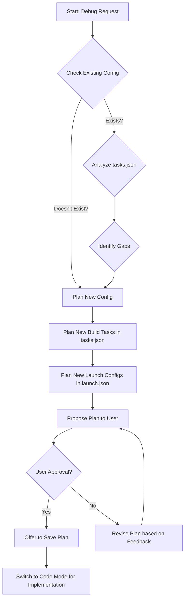

# Debugging Setup Plan for AutoBot1/AutoBot.csproj

This plan outlines the steps to configure Visual Studio Code for debugging the `AutoBot1/AutoBot.csproj` project using a specific MSBuild executable.

## Goal

Enable debugging for `AutoBot1/AutoBot.csproj` using `"C:\Program Files\Microsoft Visual Studio\2022\Enterprise\MSBuild\Current\Bin\MSBuild.exe"`, supporting both `x64` (default) and `x86` configurations.

## Workflow Diagram

## Detailed Steps

1.  **Modify `.vscode/tasks.json`:**
    *   Add a task named `Build AutoBot1 (Debug x64)`:
        *   **Command:** `"C:\Program Files\Microsoft Visual Studio\2022\Enterprise\MSBuild\Current\Bin\MSBuild.exe"`
        *   **Arguments:**
            *   `"${workspaceFolder}/AutoBot1/AutoBot.csproj"`
            *   `/t:Build`
            *   `/p:Configuration=Debug`
            *   `/p:Platform=x64`
        *   **Type:** `process`
        *   **Problem Matcher:** `$msCompile`
    *   Add a task named `Build AutoBot1 (Debug x86)`:
        *   **Command:** `"C:\Program Files\Microsoft Visual Studio\2022\Enterprise\MSBuild\Current\Bin\MSBuild.exe"`
        *   **Arguments:**
            *   `"${workspaceFolder}/AutoBot1/AutoBot.csproj"`
            *   `/t:Build`
            *   `/p:Configuration=Debug`
            *   `/p:Platform=x86`
        *   **Type:** `process`
        *   **Problem Matcher:** `$msCompile`

2.  **Create/Modify `.vscode/launch.json`:**
    *   Ensure the `.vscode` directory exists.
    *   Create or update `launch.json` within `.vscode`.
    *   Add a launch configuration named `Debug AutoBot1 (x64)`:
        *   **Type:** `coreclr` (Assuming .NET Core/5+) or `clr` (for .NET Framework - might need confirmation)
        *   **Request:** `launch`
        *   **Name:** `Debug AutoBot1 (x64)`
        *   **Program:** `${workspaceFolder}/AutoBot1/bin/x64/Debug/netX.Y/AutoBot.exe` (Note: `netX.Y` needs to be replaced with the actual target framework moniker, e.g., `net6.0-windows`)
        *   **Args:** `[]`
        *   **Cwd:** `${workspaceFolder}/AutoBot1`
        *   **Console:** `internalConsole`
        *   **StopAtEntry:** `false`
        *   **PreLaunchTask:** `Build AutoBot1 (Debug x64)`
    *   Add a launch configuration named `Debug AutoBot1 (x86)`:
        *   **Type:** `coreclr` or `clr`
        *   **Request:** `launch`
        *   **Name:** `Debug AutoBot1 (x86)`
        *   **Program:** `${workspaceFolder}/AutoBot1/bin/x86/Debug/netX.Y/AutoBot.exe` (Note: `netX.Y` needs to be replaced)
        *   **Args:** `[]`
        *   **Cwd:** `${workspaceFolder}/AutoBot1`
        *   **Console:** `internalConsole`
        *   **StopAtEntry:** `false`
        *   **PreLaunchTask:** `Build AutoBot1 (Debug x86)`

## Next Steps

After saving this plan, switch to "Code" mode to implement these changes in `.vscode/tasks.json` and `.vscode/launch.json`.