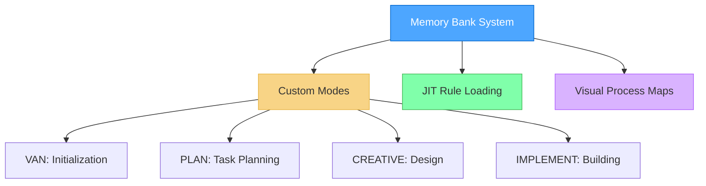
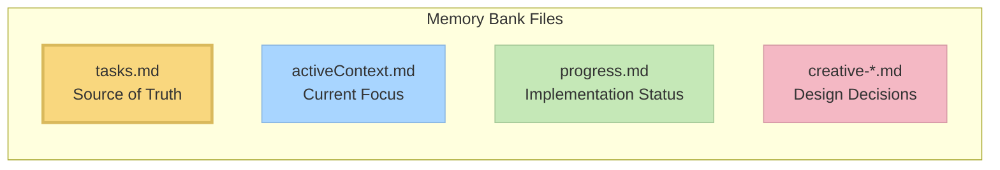

# Advanced Roo Code Memory Bank

A modular, graph-based task management system that integrates with Roo Code custom modes for efficient, structured development workflows.




---

## Overview

**Memory Bank** is a personal project that brings a structured, phase-based approach to development using Roo Code’s custom modes. It leverages Just-In-Time (JIT) rule loading, persistent memory files, and adaptive workflows for a seamless and intelligent development experience.

---

## Key Concepts

### Modular, Graph-Based Workflow

- **Interconnected Modes**: Modes act as nodes in a workflow graph, enabling logical progression (VAN → PLAN → CREATIVE → IMPLEMENT).
- **Persistent Memory**: State and context are maintained across mode transitions via dedicated memory bank files.
- **Adaptive Guidance**: Each mode tailors its recommendations based on project complexity.

### Isolated, Mode-Specific Rules

- **No Global Rules**: Only the active custom mode’s rules are loaded, keeping your main Roo Code environment unaffected.
- **JIT Rule Loading**: Loads only the rules needed for the current phase, optimizing context and performance.
- **Future-Proofing**: Global rules space remains open for future features.

### CREATIVE Mode & Claude’s “Think” Tool

- Inspired by [Anthropic’s Claude “Think” tool](https://www.anthropic.com/engineering/claude-think-tool), CREATIVE mode:
  - Structures design exploration
  - Documents pros/cons and alternatives
  - Breaks down complex problems
  - Records reasoning for future reference

See [CREATIVE Mode and Claude's "Think" Tool](creative_mode_think_tool.md) for more details.

---

## Features

- **Visual Workflow Maps**: Clear diagrams for each development phase.
- **Just-In-Time Rule Loading**: Only relevant rules are active.
- **Decision Trees & Checkpoints**: Guided, phase-based workflows.
- **QA Anywhere**: Technical validation can be triggered from any mode.
- **Platform-Aware**: Commands adapt to your operating system.

---

## Installation

### Prerequisites

- **Visual Studio Code**
- **Roo Code Extension**: [Install here](https://marketplace.visualstudio.com/items?itemName=RooVeterinaryInc.roo-cline)
- **AI Model**: Claude 3.7 Sonnet recommended for best results (especially in CREATIVE mode).

---

## Getting Started

### 1. Create Your Workspace

- **Use this repository as a template:**
  1. Click **"Use this template"** on the GitHub page.
  2. Create a new repository from the template.
  3. Clone your new repository:
     ```
     git clone https://github.com/your-username/your-new-repo.git
     ```

### 2. Open in VS Code

- Launch VS Code.
- Open your cloned workspace folder.

### 3. Activate Roo Code Modes

- Ensure the [Roo Code extension](https://marketplace.visualstudio.com/items?itemName=roocode.roocode) is installed.
- Use the Roo Code sidebar to switch between modes as described below.

---

## Workflow Guide

### 1. Start with VAN Mode

- Switch to **VAN** mode in Roo Code.
- Type `VAN` to initialize the project.
- VAN will analyze your project structure and assess task complexity.

### 2. Progress Through the Workflow

- **Level 1 tasks:** Proceed directly to **IMPLEMENT** after VAN.
- **Level 2–4 tasks:** Follow the full workflow:  
  **VAN → PLAN → CREATIVE → IMPLEMENT**
- **At any point:** Type `QA` to perform a technical validation.

### 3. Mode Descriptions

- **VAN:** Initialize the project and determine complexity.
- **PLAN:** Create a detailed implementation plan.
- **CREATIVE:** Explore and document design options for complex components.
- **IMPLEMENT:** Systematically build the planned components.
- **QA:** Validate technical implementation (can be used in any mode).

> **Tip:**  
> Switch modes at any time using the Roo Code sidebar or command palette for a seamless, guided workflow.

---

## QA Functionality

QA is not a separate custom mode, but a set of validation functions available from any mode. Simply type `QA` in any mode to perform technical validation whenever needed.

---

## Example Usage Video

[](https://youtu.be/dF4uCZAY1tk?feature=shared&t=792)

*Note: This repository was originally created for Cursor but has now been converted for Roo Code, so just follow prompts and usage steps in the video to understand the general logic.*

---

## Core Files and Their Purposes



- **tasks.md**: Central source of truth for task tracking.
- **activeContext.md**: Maintains focus of current development phase.
- **progress.md**: Tracks implementation status.
- **creative-*.md**: Design decision documents generated during CREATIVE mode.

---

## Resources

- [@vanzan01 - cursor-memory-bank](https://github.com/vanzan01/cursor-memory-bank)
- [Cursor Custom Modes Documentation](https://docs.cursor.com/chat/custom-modes)
- [Memory Bank Upgrade Guide](memory_bank_upgrade_guide.md)
- [CREATIVE Mode and Claude's "Think" Tool](creative_mode_think_tool.md)
